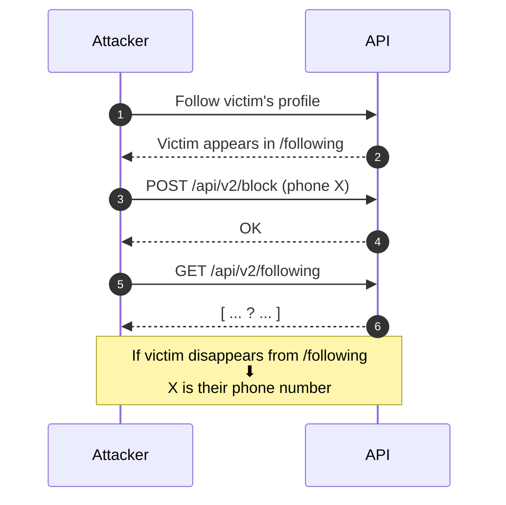
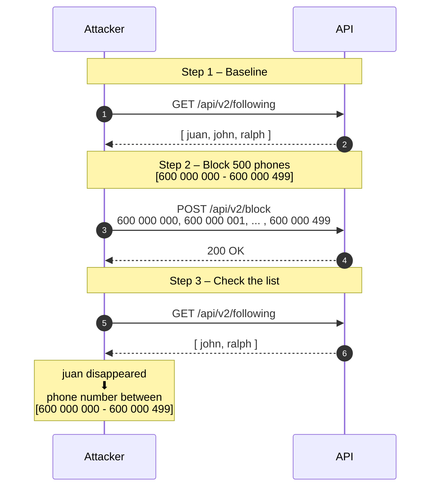
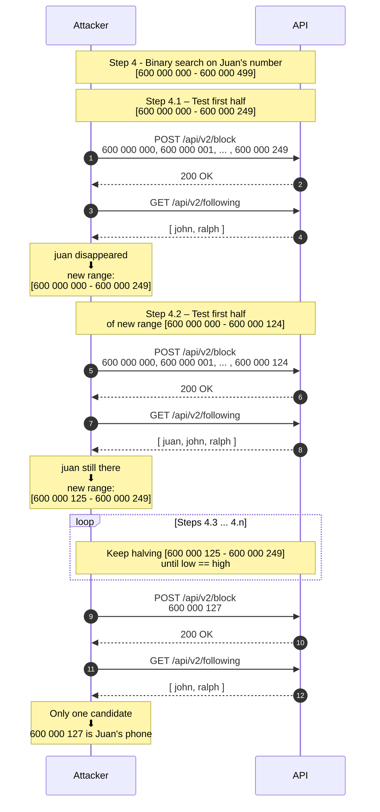
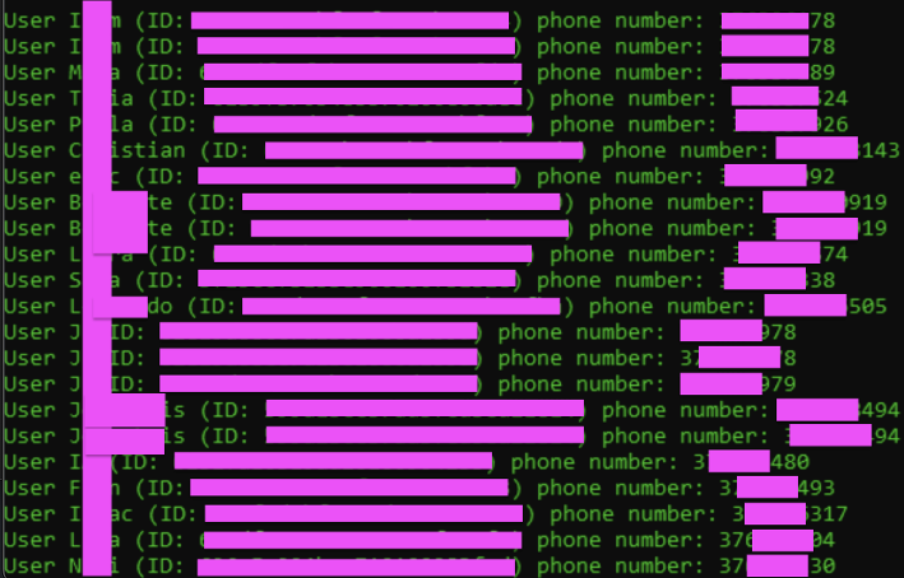

In this post I will show how, by combining two regular features, it was possible to **figure out the phone number of almost any user** on a large social media platform with millions of users.

## Context: Two Harmless Features

The application had two independent features that, on their own, made sense and seemed harmless:

- **Follow other users:**
  - The API exposes an endpoint such as:

    ```http
    GET /api/v2/following HTTP/1.1
    Host: api.redacted.com
    Content-Type: application/json
    ```
  - Which returns a JSON list with the users you are following:

    ```http
    HTTP/1.1 200 OK
    Content-Type: application/json

    { 
      "followed_users": [
          {
              "id": "104",
              "name": "Juan",
              "age": 27,
              "photo": "https://cdn.redacted.com/photos/104.jpg"
          },
          ...
      ]
    }
    ```

- **Block by phone number:**
  - Users can block contacts by uploading their phone book, which makes the following request:

    ```http
    POST /api/v2/block HTTP/1.1
    Host: api.redacted.com
    Content-Type: application/json

    {
        "phoneNumbers": [ 34600111222, 34600111223, ... ]
    }
    ```

- There is also an endpoint to **unblock everyone at once**:
```http
POST /api/v2/unblockAll HTTP/1.1
Host: api.redacted.com
```

Individually, both features seem harmless:

- You can see a list of people you follow.  
- You can block phone numbers from your address book so that those people cannot interact with you.

The problem appears when we look at **how they interact**.


## Where the Magic Happens: Turning Features into an Oracle

When you follow someone on the platform, they appear in your `following` list.

If you later **block the phone number** associated with that user, the blocked user **disappears** from your `following` list.

This gives us a powerful **oracle**:

- **If a user disappears from the `following` list after blocking a phone number → that phone number belongs to them.**
- If they do not disappear → the number does not belong to them.

So, from a high level, the attack looks like this:



With this, recovering a single phone number becomes "just" a matter of trying candidates until the victim disappears from the list.

However, that would mean a number of requests too high to consider this as a practical scenario at scale. But there were three design choices that made the attack possible:

- You can **block hundreds of phone numbers in a single request** (in practice, around 500 phone numbers per request were accepted).  
- The app is **location-based**, so the attacker can focus on specific country ranges.  
- There were **no rate limits** for these endpoints, and even previously banned accounts could use them without facing **any restriction**.


## Blocking Hundreds of Phones per Request

The `/api/v2/block` endpoint accepted **around 500 phone numbers per request** (more could be sent and it returned the same successful response, however, only the first ~500 numbers in the array were effectively processed).

So, instead of blocking phone numbers one by one, we can block **large groups** and observe whether the victim disappears from the `following` list. 

The high-level attack scenario is:

1. **Baseline**
  - Follow the victim so they appear in `/api/v2/following`.
  - Save the initial list of followed users.

2. **Block a group**
  - Send a `/api/v2/block` call with 500 candidate phone numbers.

3. **Check the list**
  - Call `/api/v2/following` again.
  - If the length of the list is **unchanged**, none of those 500 numbers belongs to the victim, so the attack simply moves on to the next 500‑number batch.
  - If the length **decreases**, we know the victim’s number is **somewhere in that group of 500**, and at that point the numbers are unblocked (via `/api/v2/unblockAll`)  to reset the state and start the binary search phase on that specific range.



## Binary Search on Phone Numbers

Once we know that the victim’s phone number is inside a group (a 500‑number batch that caused the victim to disappear), we can perform a **binary search** over that group:

- Split the 500 candidates into two sets of 250.
- Block the first 250 numbers and check `/api/v2/following` again.
  - If the victim disappears, their number is in that half.
  - If not, it is in the other half.
- Repeat, halving the search space each time.

After at most $\log_{2}(500)$ ≈ 9 iterations, we are left with a **single phone number**.




## From One User to a Whole Country

Blocking hundreds of numbers at a time is good, but the real impact comes from understanding the **phone numbering plans** and **location-based nature** of the platform.

- The app is geolocated: users typically see other users from their current city or country.
- Many countries have **predictable mobile number ranges**.


### 🇦🇩 Andorra: All Numbers in Minutes

Andorra is a small country in the Pyrenees, located between Spain and France. Its mobile numbers follow patterns like:

- `+376 3XX XXX`
- `+376 5XX XXX`
- `+376 6XX XXX`

Each of these patterns gives around **100,000 possible numbers**, for a total of **300,000 candidates**, which makes it perfect to quickly demonstrate the attack.

So, in one test:

- The location of the account was set to Andorra.
- 20 random users from that region were followed.
- The script was run over the entire Andorra phone range, issuing one request per second: first a block request containing 500 phone numbers, followed by a request to read the `following` list. In total, 1,200 requests would be sent, plus some additional block/unblock/check requests during the binary-search phase.

In practice, the phone numbers of **17 out of 20 users were recovered in around 20 minutes** (the other 3 likely used foreign numbers).


_Result of running the script against 20 random users from Andorra._


This scenario was the **PoC shown in the report** to clearly demonstrate the impact in a small, bounded country. However, in a realistic scenario, an attacker would instead target a larger country, such as **Spain**, where mobile ranges follow patterns like `6XX XXX XXX` and `7XX XXX XXX`. Sweeping those ranges would require **hundreds of thousands of block operations and checks**, taking around **10 days** if we keep the same conservative pace, which is still a perfectly feasible scenario - especially considering that an attacker could use multiple accounts, increase the request rate, and follow many more users (there were no meaningful limits on this) to maximise the number of affected victims.


## Conclusion

I discovered this bug around two years ago and it is still one of my favourite findings. Not only because of the impact and the fact that it became my first five‑figure bounty, but also because it is the kind of bug you can easily explain to non‑technical friends and they will get it.

It was also found shortly after by my friend [Alexandro Bindreiter](https://x.com/alexbindrei){:target="_blank"}, *who still offered to share ideas and push to increase its severity*.

I hope this write‑up serves as a motivation to remember that, many times, finding critical issues is not about using extremely advanced techniques or complex exploits, but also about stopping to think about the application, understanding its flows, business rules and components, and then looking for creative ways to break them.