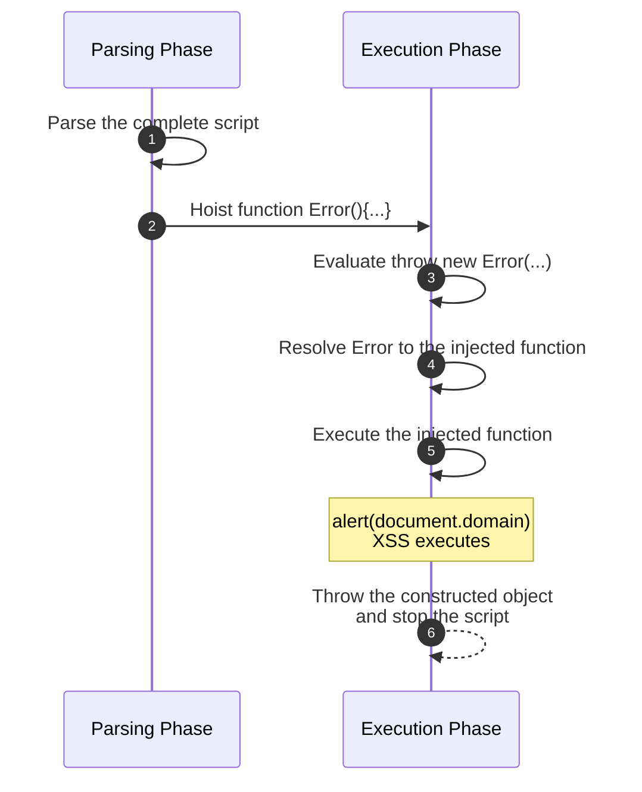

Some time ago, while testing a web application, I found a reflected XSS that looked useless at first.

A GET parameter was reflected inside a `<script>` tag in two different contexts. The most interesting one was inside a JavaScript comment that appeared immediately after a `throw new Error(...)`. So, apparently, even if I could escape the comment, XSS wouldn't be possible, as any code placed after the `throw` should never be reached.

## First Signal

The vulnerable page received an `id` parameter that was expected to be a UUID.

When the value was invalid, it returned an error response that included an inline script similar to this:

```html
<script>
throw new Error("Unable to load item: invalid id test");
/* item lookup rejected: id=test did not match UUID format */
</script>
```

At first, this was promising because the reflection happened inside a JavaScript context.

The first reflection was inside a quoted string:

```javascript
throw new Error("Unable to load item: invalid id test");
```

That reflection was correctly escaped. Quotes, `<`, and `>` were handled properly, so I could not break out of the string.

The second reflection was inside a comment:

```javascript
/* item lookup rejected: id=test did not match UUID format */
```

That one was more interesting because `*/` was not being escaped, so I could break out of the comment context.

So a payload like `*/alert(document.domain)/*` produced valid JavaScript:

```html
<script>
throw new Error("Unable to load item: invalid id */alert(document.domain)/*");
/* item lookup rejected: id=*/alert(document.domain)/* did not match UUID format */
</script>
```

However, the `alert()` was never executed. The script reached `throw new Error(...)`, threw an exception, and stopped before getting to my injected code.

## The Missing Piece: Hoisting

**JavaScript** does not simply start executing the first line. Before execution, function declarations are processed and made available in their scope. This behavior is usually known as [hoisting](https://developer.mozilla.org/en-US/docs/Glossary/Hoisting){:target="_blank"}.

That changed the problem. I only needed to inject a **function declaration** after the `throw`, and let hoisting make it available before execution.

JavaScript exposes [`Error`](https://developer.mozilla.org/en-US/docs/Web/JavaScript/Reference/Global_Objects/Error){:target="_blank"} as a standard built-in constructor on the [global object](https://developer.mozilla.org/en-US/docs/Glossary/Global_object){:target="_blank"}. In this classic script, the identifier normally resolves to `window.Error`:

```javascript
new Error("Unable to load item: invalid id test")
```

But `Error` is just an identifier that has to be resolved. If I could inject this in the same script:

```javascript
function Error() {
  alert(document.domain);
}
```

then `new Error(...)` would resolve to my hoisted function instead of the native constructor.

The last piece is how `throw` works. The [`throw` statement](https://developer.mozilla.org/en-US/docs/Web/JavaScript/Reference/Statements/throw){:target="_blank"} throws an expression. In this case, that expression is `new Error(...)`, so JavaScript must evaluate it first.

The execution flow became:



The script still stops at the `throw`, but by then the XSS has already executed.

## The Payload

The final payload was:

```text
*/function Error(){alert(document.domain)}/*
```

The resulting response looked like this:

```html
<script>
throw new Error("Unable to load item: invalid id */function Error(){alert(document.domain)}/*");
/* item lookup rejected: id=*/function Error(){alert(document.domain)}/* did not match UUID format */
</script>
```

The payload broke out of the comment and placed a `function Error(){...}` declaration in the same script.

Before executing the first line, hoisting made the script behave conceptually like this:

```javascript
function Error() {
  alert(document.domain);
}

throw new Error("Unable to load item: invalid id ...");
```

The page still threw an exception. It just did it after calling my injected constructor.

## Conclusion

I liked this bug because it looked dead for two different reasons: the string reflection was safely escaped, and the only reflection I could break out of appeared after an unconditional `throw`. But JavaScript still had to evaluate `new Error(...)` before throwing it.

By redefining `Error` with a hoisted function declaration, the payload turned an apparently non-exploitable reflection into XSS.

## Further Reading

For more examples of this idea in XSS contexts, I recommend [Javascript Hoisting in XSS Scenarios](https://jlajara.gitlab.io/Javascript_Hoisting_in_XSS_Scenarios){:target="_blank"} by Jorge Lajara and [Having some fun with JavaScript hoisting](https://joaxcar.com/blog/2023/12/13/having-some-fun-with-javascript-hoisting/){:target="_blank"} by Johan Carlsson.
